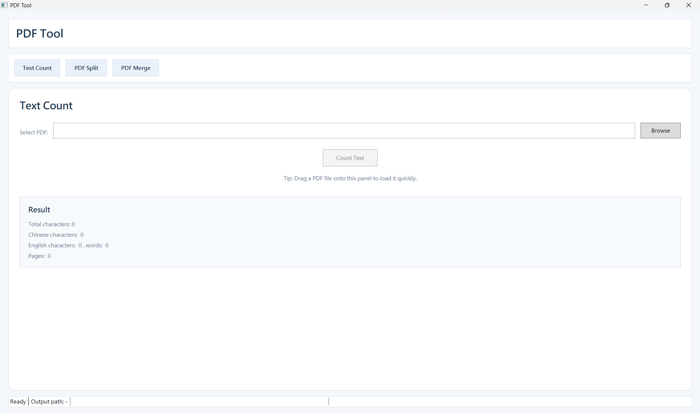

# PDF Tool
A lightweight Windows desktop PDF utility for counting, splitting, and merging PDF files.


## Features

### PDF Text Statistics
- Chinese character count
- English character count
- English word count
- Page count

### PDF Split
- Split every N pages
- Split by custom page ranges

### PDF Merge
- Merge multiple PDF files

### Usability
- Drag and drop support across all modules
- Status feedback

## Quick Start
### Requirements
- Windows 10 or later
- .NET 8 SDK
- Visual Studio 2022 or newer recommended

### Run with Visual Studio
1. Open [PdfTool.sln](C:/Users/user/Documents/PdfTool/PdfTool.sln) in Visual Studio.
2. Wait for NuGet package restore to finish.
3. Press `F5` to run the application.

### Run with the .NET CLI
Open a terminal in the project folder:

```powershell
dotnet restore
dotnet build
dotnet run
```

## Notes
- This is a local desktop application. It does not require a browser or web server.
- On some Windows devices, Smart App Control may limit direct execution of unsigned local apps.
- If that happens, run the project through Visual Studio with `F5`.

## Known Issues
You may see this warning during build:

- `NU1900`

This usually means NuGet vulnerability metadata could not be fetched from [https://api.nuget.org/v3/index.json](https://api.nuget.org/v3/index.json). It does not block normal build or local execution in this project.

## Contact
Author: [yoyohaha00](https://github.com/yoyohaha00)


